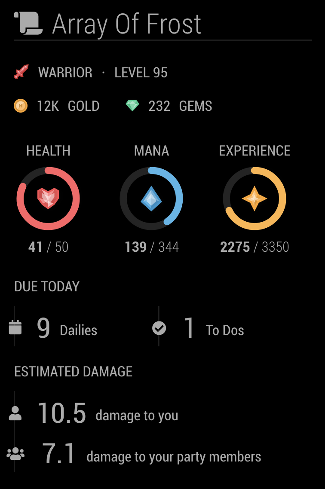

# MMM-HabiticaStats: A MagicMirror² Module
`MMM-HabiticaStats` is a module for [MagicMirror²](https://github.com/MichMich/MagicMirror) that displays player statistics for [Habitica](https://habitica.com).

 **REQUIRED API KEYS:**

 You're gonna need a (free) Habitica account to get an API token (see the [Habitica wiki](https://habitica.fandom.com/wiki/API_Options#API_Token) for details on how to find your API Token in your Habitica account).

## Screenshots

### Example Screenshots of MMM-HabiticaStats running in the default MagicMirror² theme:



-------


### Example Screenshots of MMM-HabiticaStats running in the [WallberryTheme](https://github.com/delightedCrow/WallberryTheme):


## Installing the Module

To use this module:
1.  Copy the `MMM-HabiticaStats` folder to your `MagicMirror/modules` directory
2.  Add the module to the modules array in the `config/config.js` file like in the following example:

````javascript
modules: [
	{
		module: "MMM-HabiticaStats",
		position: "middle_center", // put it wherever you want
		config: {
			userID: "YOUR-HABITICA-USER-ID-HERE",
			APIToken: "YOUR-HABITICA-API-TOKEN-HERE"
		}
	}
]
````

## Configuration options

The following properties can be configured:


| Option                      | Type    | Description
| ----------------------------|---------| -----------
| `userID`                    | String  | Your Habitica userID. Sign up for free at [https://habitica.com](https://habitica.com). <br><br>  This value is **REQUIRED**
| `APIToken`                  | String  | Your Habitica API Token. <br><br>  This value is **REQUIRED**
| `refreshRate`               | Number  | How often the module should refresh your Habitica data (in milliseconds). <br><br> **Possible values:** Any positive integer <br> **Default value:** `60 * 60 * 1000`, 1 hour
| `backgroundBlurOn`          | Boolean | Turn the background blur on; good for making the text more legible on photo backgrounds. <br><br> **Possible values:** `true` (turn on) or `false` (turn off) <br> **Default value:** `true`
| `zoom`                      | Float   | Scale this module using the CSS zoom property. <br><br> **Possible values:** A float number. Examples: `1.5` (scale up 150%), `0.7` (scale down 70%) <br> **Default value:** none
| `orientation`               | String  | Whether to display the module in portrait or landscape orientation. <br><br> **Possible values:** `portrait`, `landscape`<br> **Default value:** `portrait`
| `positionCSS`               | String  | Finely position this module with the power of CSS. BE CAREFUL, you can break all kinds of things with this. <br><br> **Possible values:** Any string of valid CSS. Example: `"float: right; position: relative; top: -10px;"` <br> **Default value:** none

## Fixing The Background Blur

##### Please make sure you have the config option `backgroundBlurOn: true` set first!

If you're running MagicMirror using Electron (i.e, not in `serveronly` mode) and the background blur isn't showing up for you, try enabling Electron's `experimentalFeatures` option by adding the following block to your `config` options in your MagicMirror `config.js` file:

````javascript
electronOptions: {
	webPreferences: {
		experimentalFeatures: true,
		nodeIntegration: false
	}
},
````

## Contributing & Development

### Changelog

To view the changelog see [CHANGELOG.md](CHANGELOG.md).

### Building CSS

This module uses SASS, so to make style changes please edit the `MMM-HabiticaStats.scss` file and use node-sass to compile the css file:

- Run the command `npm install` to install node-sass.
- Run `npm run watch` and node-sass will autocompile the CSS file any time changes are made to the `MMM-HabiticaStats.scss` file.
- Run `npm run build` to build the CSS file.
